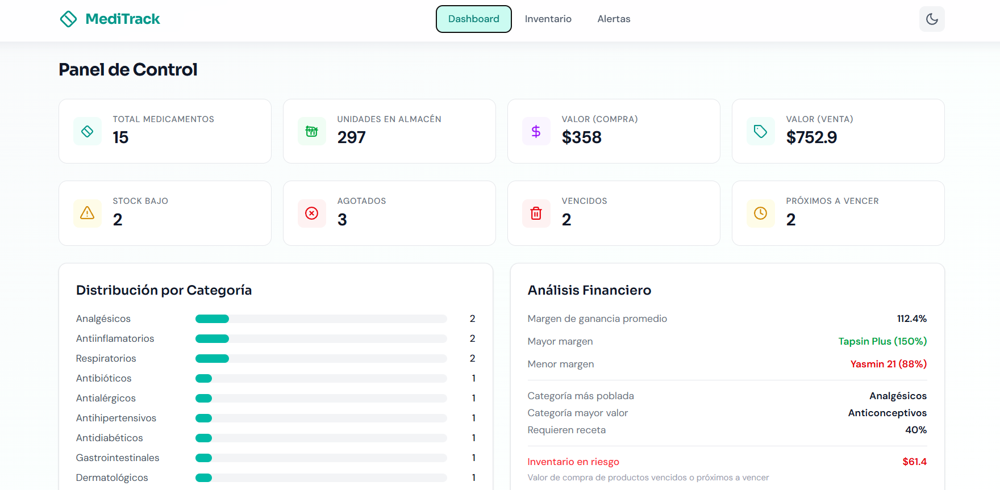
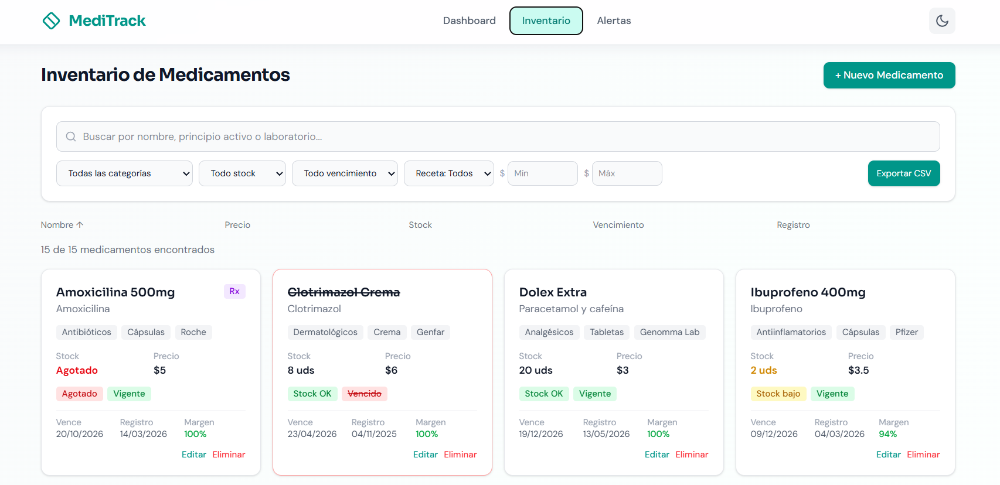
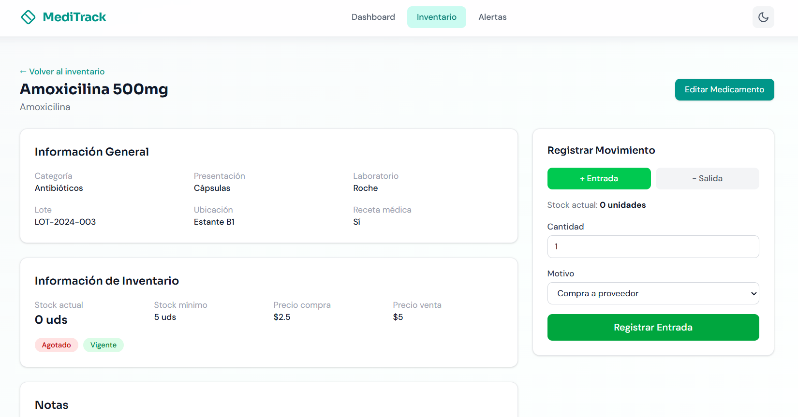

# MediTrack — Sistema de Control de Inventario para Farmacia

Aplicación web SPA para la gestión integral de inventario de medicamentos en farmacias de barrio. Resuelve problemas de medicamentos vencidos, stock no controlado, compras duplicadas y falta de visibilidad del inventario mediante una interfaz moderna, responsive y eficiente.

## Capturas de Pantalla

### Dashboard (`/`)


### Catálogo de Inventario (`/inventario`)
 

### Vista de Detalle (`/inventario/:id`)


## Tecnologías Utilizadas

| Tecnología                         |
| ---------------------------------- |
| **Vite**                           |
| **React 19**                       |
| **TypeScript**                     |
| **React Router**                   |
| **Zustand**                        |
| **React Hook Form + Zod**          |
| **Tailwind CSS v4**                |
| **Vitest + React Testing Library** |

## Guía de Instalación y Ejecución

```bash
# Clonar el repositorio
git clone https://github.com/pedrocastellanos/meditrack.git
cd meditrack

# Instalar dependencias
npm install

# Ejecutar en modo desarrollo
npm run dev

# Ejecutar pruebas
npm test

# Construir para producción
npm run build
```

## Estructura del Proyecto

```
meditrack/
├── src/
│   ├── components/
│   │   ├── ui/              # Componentes genéricos (Modal, EmptyState, StatsCard)
│   │   ├── medicamentos/    # Formulario y tarjetas de medicamentos
│   │   ├── movimientos/     # Formulario de movimientos e historial
│   │   ├── notificaciones/  # Sistema de toasts
│   │   └── layout/          # Navbar, PageContainer
│   ├── pages/               # Vistas principales (Dashboard, Inventario, Detalle, Alertas, 404)
│   ├── store/               # Stores de Zustand (medicamentos, tema)
│   ├── hooks/               # Custom hooks (useFilter, useNotification)
│   ├── data/                # Seed data, constantes del dominio, tipos
│   ├── utils/               # Formateadores y validadores
│   └── __tests__/           # Pruebas unitarias
```

## Decisiones Técnicas

1. **Zustand sobre Context API + useReducer**: Se eligió Zustand por su simplicidad, menor boilerplate, middleware de persistencia integrado y rendimiento superior al evitar re-renderizados innecesarios mediante suscripciones selectivas.

2. **React Hook Form + Zod sobre validación manual**: La combinación RHF + Zod proporciona validación en tiempo real con tipado inferido automáticamente, reduciendo errores y mejorando la experiencia de desarrollo al unificar esquemas de validación y tipos.

3. **Persistencia en localStorage**: Se implementó mediante el middleware `persist` de Zustand, abstrayendo completamente la lógica de almacenamiento de los componentes. Los cambios de estado se sincronizan automáticamente sin que las vistas interactúen directamente con el storage del navegador.

4. **Lazy loading con React.lazy y Suspense**: Cada página se carga bajo demanda, reduciendo el bundle inicial drásticamente. Los fallbacks con spinner animado mejoran la percepción de rendimiento.

5. **useMemo y useCallback para optimización**: Los cálculos estadísticos del Dashboard se envuelven en useMemo para evitar recomputaciones en cada render. Las funciones de mutación (create, update, delete) usan useCallback al pasarse a componentes hijos para prevenir re-renderizados innecesarios del DOM.

## Custom Hooks Desarrollados

### `useForm`
- **Propósito:** Abstraer la integración de React Hook Form + Zod, centralizando la configuración de validación en tiempo real (`mode: 'onChange'`) y el resolver de esquemas. Permite que cualquier formulario del sistema consuma validación tipada sin repetir boilerplate.
- **Parámetros:** `schema: ZodType`, `defaultValues: TFieldValues`
- **Retorno:** Objeto completo de `useForm` de React Hook Form (`register`, `handleSubmit`, `reset`, `watch`, `formState`, etc.)

### `useFilter`
- **Propósito**: Encapsular la lógica de búsqueda por texto, filtros combinados (categoría, stock, vencimiento, receta, precio) y ordenamiento dinámico.
- **Parámetros**: `medicamentos: Medicamento[]`
- **Retorno**: `{ filtros, setFilter, limpiarFiltros, resultados }`

### `useNotification`
- **Propósito**: Controlador imperativo de notificaciones toast con auto-destrucción temporizada.
- **Parámetros**: Ninguno
- **Retorno**: `{ notificaciones, notificar, eliminar, colores }`